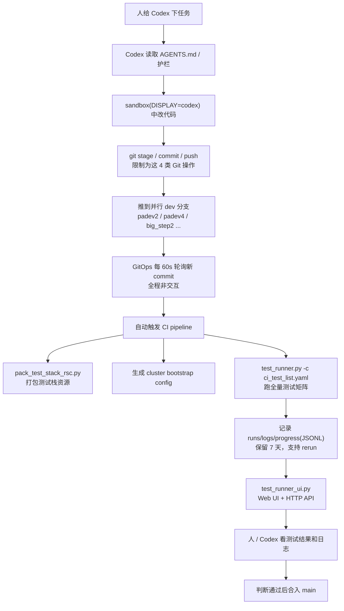
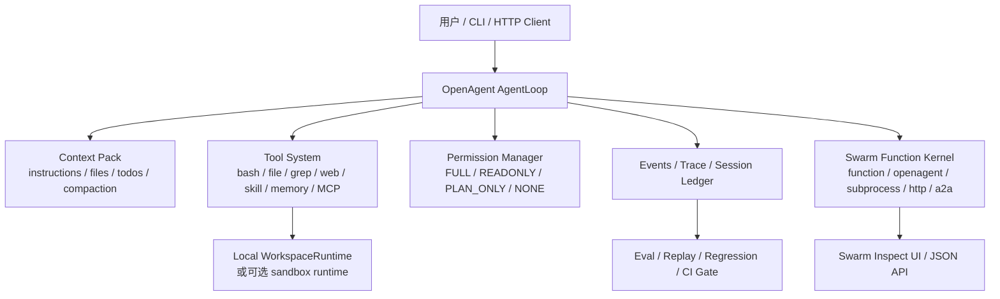
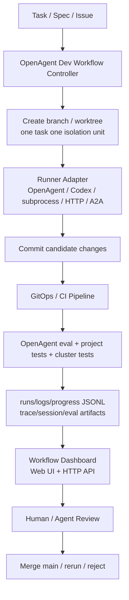

# Codex GitOps 协作开发方式 vs OpenAgent 使用方式

> 调研对象：用户截图中的 Fluxon / Codex 协同开发流程，以及当前 harness 里的 OpenAgent、openagent-runtime-http、swarm、eval、BrainBox 能力。

## 1. 结论先行

截图里的方式本质上不是一个单纯的 agent runtime，而是一套 **GitOps 驱动的协作开发工厂**：

- Codex 负责在受控 sandbox 里改代码。
- Git 分支和 commit 是任务状态的主载体。
- GitOps 轮询新 commit 后触发 CI。
- CI 负责打包测试资源、生成 cluster bootstrap config、跑完整测试矩阵。
- Web UI / HTTP API 展示测试结果和日志。
- 人或 Codex 根据结果判断是否合入 main。

我们当前 OpenAgent 的主线不同。OpenAgent 更像一个 **Agent Harness Runtime + 可观测评测底座**：

- `AgentLoop`、tool schema、permission、context、session ledger 是核心。
- `openagent-runtime-http` 把 core 包成 HTTP / SSE service。
- `swarm` 负责多 runner / 多 agent 编排。
- eval/replay/trace/Langfuse 负责能力回归和行为证据。
- BrainBox 提供可对接的 sandbox 基础设施。

所以差异不是“Codex 方式先进、OpenAgent 方式落后”，而是控制面不一样：

- 截图方案把 **Git / CI / cluster / Web UI** 当控制面。
- OpenAgent 当前把 **session / trace / context / eval** 当控制面。

最合理的演进不是二选一，而是在 OpenAgent 外围补一层 **GitOps Dev Workflow Control Plane**，让 OpenAgent 作为可观测、可评测的 coding runner 接进去。

## 2. 截图方式复原

根据截图，Fluxon 的 Codex 协同开发流程大致如下：

这个流程里，Codex 不直接拥有最终发布权。它主要负责产生候选变更；GitOps、CI、测试矩阵、UI 和人工判断共同构成质量门禁。

## 3. OpenAgent 当前使用方式

OpenAgent 当前更偏 runtime-first：

相关现有能力：

- `openagent/doc/context.md`：上下文预算、结构化 compaction、file-read state、context pack snapshots、session parts。
- `openagent/doc/operations.md`：stream events、session ledger、trace、Langfuse export、eval report、CI gate。
- `openagent/doc/swarm.md`：多 runner 编排、worker workspace isolation、merge-back review、inspect UI / JSON API。
- `openagent-runtime-http/`：HTTP / SSE runtime service、session API、permission / question bridge、quota、structured logs。
- `brainbox/`：Go/Kubernetes sandbox platform、Manager API、Controller、Console、CI/CD、E2E。

## 4. 核心差异

| 维度 | 截图里的 Codex GitOps 方式 | 当前 OpenAgent 方式 |
| --- | --- | --- |
| 控制面 | Git 分支、commit、GitOps、CI、测试 UI | Session、turn、trace、context、eval、runtime HTTP |
| 工作单元 | 一个任务对应一个 dev branch / commit 链 | 一个 task/session/run/turn，对应 trace 和 session ledger |
| 并行模型 | 多个 Codex 任务推到不同 dev 分支，天然互不干扰 | `swarm` 支持多 runner 并行，但不默认映射成 Git branch |
| 隔离方式 | sandbox + branch-per-task | WorkspaceRuntime、worker workspace isolation、可选 BrainBox sandbox |
| 变更落点 | agent 直接产出 Git commit，后续由 CI 验证 | agent 产出文件变更、patch event、trace；是否提交不是 core 的一等流程 |
| 测试触发 | GitOps 检测新 commit 自动触发 CI pipeline | eval runner / ci_gate 已有，但没有统一的 commit-triggered GitOps 流程 |
| 测试资源 | pack test stack、cluster bootstrap、全量测试矩阵 | 本地 eval/replay、Terminal-Bench、Harbor、domain eval；cluster 测试需外接 |
| 日志与进度 | `runs/logs/progress(JSONL)`，保留 7 天，支持 rerun | `.openagent/sessions`、trace JSONL、context snapshots、summary/report |
| UI | test runner UI + HTTP API，面向 CI 结果和日志 | swarm inspect UI、runtime HTTP/SSE；缺统一“开发任务 CI 看板” |
| 人工门禁 | 人 / Codex 看 UI 结果后合 main | tool permission、merge-back review、eval gate；缺 main merge gate 产品化 |
| 安全边界 | Codex 仅允许 stage/commit/push 等有限 Git 操作，非交互 GitOps | permission rulesets、secret redaction、tool approval、sandbox runtime；Git 操作策略未统一成 workflow |
| 适用目标 | 团队级软件交付、并行开发、CI 质量门禁 | Agent runtime、上下文工程、可观测、评测、可插拔 agent 编排 |

## 5. 各自优势

### 5.1 截图方式更强的地方

- **工程交付闭环完整**：从 agent 改代码到 CI、测试日志、人工合并，是团队软件工程闭环。
- **并行开发天然简单**：branch-per-task 是 Git 已验证过的隔离模型。
- **验证权外置**：Codex 不自己宣布“完成”，而是让 CI 和测试矩阵说话。
- **任务结果可协作查看**：Web UI / HTTP API 面向人和 agent 都能消费。
- **失败可 rerun**：日志、progress JSONL、7 天保留，让失败分析有载体。

### 5.2 OpenAgent 更强的地方

- **runtime 内部证据更细**：tool-call、tool-result、step、patch、usage、runtime warning 都能进 trace。
- **上下文工程更系统**：instruction、file state、todo、compaction、context snapshot 都是一等对象。
- **评测更贴近 agent 行为**：不仅看测试是否过，还能看模型调用次数、工具调用次数、成本、trace 完整性、runtime warnings。
- **runner 协议更开放**：swarm 支持 function、OpenAgent、subprocess、HTTP、A2A，不被单一 Codex CLI 绑定。
- **可作为底层能力嵌入**：HTTP runtime、SDK、swarm runner 都能被外部平台调用。

## 6. OpenAgent 当前缺口

如果目标是复刻或超越截图里的协同开发方式，OpenAgent 缺的是外围工程控制层，而不是单纯 agent loop：

1. **GitOps task controller**
   - 监听任务队列或分支变化。
   - 为每个任务创建 branch/worktree。
   - 调度 OpenAgent / Codex / 外部 runner 执行。
   - 限制 agent 可执行的 Git 操作。

2. **Branch-per-task isolation**
   - `swarm` 已有 worker workspace isolation 和 merge-back review。
   - 但还没有把 worker workspace 映射为 Git branch / worktree / PR 的标准流程。

3. **Commit-triggered eval / CI**
   - `openagent.core.eval.ci_gate` 已能基于 report / regression fail CI。
   - 但还没有“push commit -> 自动跑 eval suite + project tests + cluster tests”的统一 pipeline 模板。

4. **测试资源打包和 cluster bootstrap**
   - BrainBox 有 K8s sandbox / E2E / GitLab CI 基础。
   - OpenAgent 还没有类似 `pack_test_stack_rsc.py`、`cluster bootstrap config` 的 agent-dev 专用测试栈打包器。

5. **统一任务看板**
   - `swarm inspect` 目前看 swarm run。
   - `openagent-runtime-http` 看 runtime session。
   - 缺一个面向“开发任务”的 UI：branch、commit、runner、CI、eval、logs、rerun、merge decision 放在一起。

6. **主干合入门禁**
   - OpenAgent 有 permission 和 merge-back policy。
   - 但还没有把 eval gate、CI status、review decision、merge main 做成显式 release policy。

## 7. 推荐融合架构

建议新增一层 `openagent-devops` 或 `openagent-workflow`，不要塞进 `AgentLoop`：

这层只负责工程协作控制；OpenAgent core 继续保持 runtime clean：

- core 不应该关心 GitOps 轮询。
- core 不应该负责合 main。
- core 应该提供可插拔 runner、trace、eval、permission、context 证据。
- workflow controller 负责把这些证据变成团队交付流程。

## 8. 可落地路线

### P0：把 OpenAgent 接入截图式流程

- 定义 `WorkflowTask`：task id、branch、base ref、runner kind、spec path、eval suite、timeout。
- 实现 branch/worktree 创建与清理。
- 用 `openagent run` 或 `openagent-swarm run --enable-openagent` 执行任务。
- 约束 runner 只能在 worktree 内写文件。
- 产出 `workflow-runs/{run_id}/progress.jsonl`。
- 执行本地测试和 `openagent.core.eval.ci_gate`。

### P1：CI / GitOps 产品化

- 新增 GitLab/GitHub pipeline 模板。
- commit push 后自动跑：
  - project unit tests；
  - OpenAgent eval suite；
  - trace integrity check；
  - budget / runtime warning gate；
  - 可选 BrainBox cluster test。
- 结果写入统一 `report.json`、`summary.md`、`progress.jsonl`。

### P2：任务看板

- 基于 `swarm inspect` 和 `openagent-runtime-http` 的经验，做 workflow dashboard。
- 展示 task、branch、commit、runner、logs、eval score、CI status、rerun 按钮、merge decision。
- 提供 HTTP API，方便 agent 自己读取状态。

### P3：多 agent 并行开发

- `swarm` runner 与 Git worktree 合并。
- 一个 parent task fanout 到多个 branch/worktree。
- merge-back review 先比较文件级冲突，再进入 PR / main merge gate。

### P4：沙箱和集群测试融合

- 把 BrainBox 作为 OpenAgent / workflow 的 sandbox backend。
- 对需要真实环境的任务，自动生成 cluster bootstrap config。
- 测试矩阵既支持普通 unit/e2e，也支持 sandbox/cluster eval。

## 9. 对项目使用方式的直接回答

如果现在问“这种使用方式和我们的 OpenAgent 项目使用方式有什么区别”，可以简化为：

- **截图方式是交付流**：重点是多分支并行、GitOps、CI、测试矩阵、UI、人工合并。
- **OpenAgent 方式是运行时**：重点是 agent loop、工具、上下文、权限、trace、eval、swarm。
- **截图方式更像外层操作系统**：它管理 agent 如何进入软件工程流水线。
- **OpenAgent 更像内核和仪表盘**：它解释 agent 每一步为什么这么做、用了什么工具、消耗多少、是否可复现、是否可评测。
- **最佳路线是组合**：让截图式 GitOps 工作流调用 OpenAgent runner，并把 OpenAgent 的 trace/eval/session 证据接入 CI UI。

## 10. 下一步建议

建议下一步做一个小型原型，而不是直接做全平台：

1. 在 `docs/` 下补 `openagent-workflow-mvp.md`，定义 P0 contract。
2. 新建一个最小 `workflow-runs/` artifact schema。
3. 写一个本地脚本：
   - 创建 worktree；
   - 调用 `openagent run`；
   - 收集 diff；
   - 跑 tests + eval ci gate；
   - 写 `progress.jsonl` 和 `summary.md`。
4. 再决定是否接 GitLab/GitHub CI 和 Web UI。

这个顺序最稳：先把“OpenAgent 作为 coding runner 进 GitOps 流程”跑通，再补 CI 和 dashboard。

